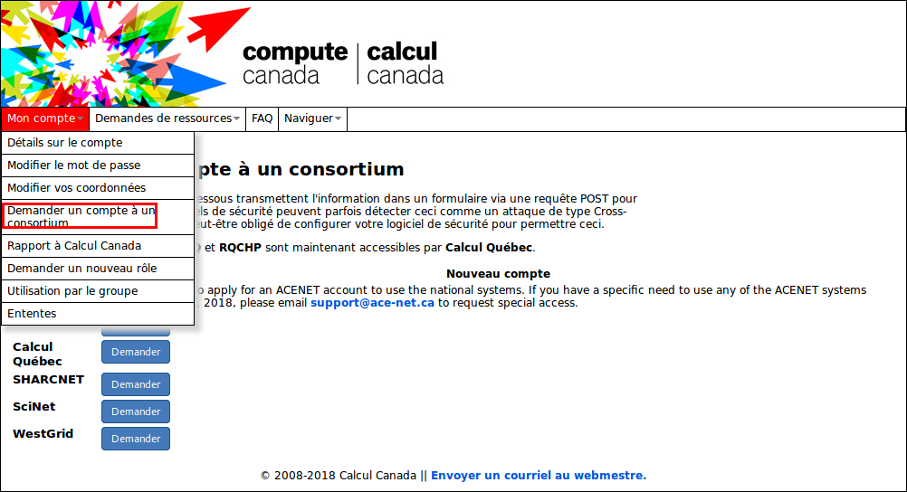

To access the lab cluster, you need a Compute Canada account

1. Register on the [CCDB website][ccdb] of Compute Canada. Click `register` and fill the form. You'll need Compute Canada Role Identifier (CCRI) of Dr. Villeneuve : yai-974

2. When you receive a confirmation email. Log again and ask an account to the Calcul Québec consortium and follow the instructions.

3. Go to [Calcul Québec Portail][calculquebec] and activate your access to guillimin in the `My account` section.

[ccdb]: https://ccdb.computecanada.ca/
[calculquebec]: https://portail.calculquebec.ca/
